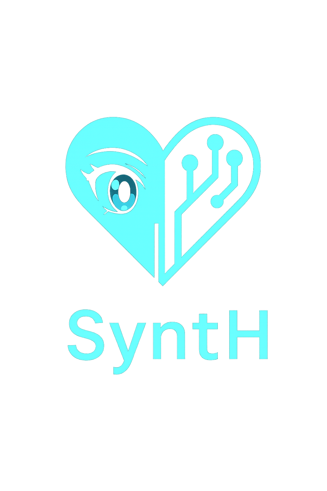

<div align="center">
   <div style="background: #222; border-radius: 12px; padding: 12px; width: 700px; height: 300px; display: flex; align-items: center; justify-content: center; margin: 0 auto;">
      
   </div>
</div>


| Branch    | Build Status                                                                                                                                         | Docs Status                                                                                                                                      |
|-----------|------------------------------------------------------------------------------------------------------------------------------------------------------|--------------------------------------------------------------------------------------------------------------------------------------------------|
| `main`    | [](https://github.com/XargonWan/Synthetic_Heart/actions)      | [](https://synth-freedom-project.readthedocs.io/en/latest/?badge=latest) |
| `develop` | [](https://github.com/XargonWan/Synthetic_Heart/actions) | [](https://synth-freedom-project.readthedocs.io/en/latest/?badge=latest) |

**Synthetic Heart**, stylized as SyntH, provides a modular stack for creating autonomous AI personas. Interfaces, language models and action plugins can be swapped at runtime.

Built around a lightweight plugin system, SyntH lets you combine different chat interfaces and LLM engines to craft persistent characters.

### Features

- Switchable LLM engines (manual trainer, ChatGPT API or a Selenium-driven ChatGPT session)
- Multiple chat interfaces including Telegram and Discord
- **SyntH Web UI**: A production-ready web interface with VRM avatar support and real-time animations
- **VRM Avatar System**: 3D animated avatars with idle, talking, and thinking states
- Action plugins such as a persistent terminal and scheduled events
- Context memory injection with `/context`
- Ollama-compatible HTTP bridge so existing Ollama clients can talk to Synthetic Heart
- Docker deployment with automatic database backups

> [!IMPORTANT]
> **Core Web UI**: As of this version, the SyntH Web UI has been promoted from `interface/` to `core/` as it is now considered an integral and inseparable part of the SyntH system. It provides essential functionality for configuration management, VRM avatar support, and real-time interaction.


### Ollama Compatibility

The project ships with an **Ollama-compatible interface** (`interface/ollama_compat_server.py`). It mirrors the standard Ollama HTTP endpoints (`/api/generate`, `/api/chat`, `/api/tags`) so any client that normally talks to a local Ollama daemon can connect to Synthetic Heart instead. Point your tools at `http://<synth-host>:11434` (configurable via `OLLAMA_HOST` / `OLLAMA_PORT`) and they will stream responses generated by your active persona. Native Ollama engine support will arrive later, but the compatibility layer lets you reuse the existing ecosystem today.

## Quickstart

1. Copy `.env.example` to `.env` and fill the required values.
2. Start the stack:
   ```bash
   docker compose up
   ```
3. If using the Selenium engine, open `http://<host>:5006` and log into ChatGPT.

See the [documentation](https://synth-freedom-project.readthedocs.io) for installation details, advanced features and contribution guidelines.

## Docker image repository
You can browse and manage Docker images for this project on [Docker Hub](https://hub.docker.com/repository/docker/xargonwan/synthetic_heart).

## Contributing

Pull requests are welcome! Please read the guidelines in the documentation before submitting.
