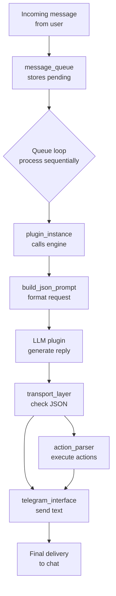

# 🧞‍♀️ Rekku Freedom Project

**Rekku Freedom Project** is a modular infrastructure to support a full-autonomous AI "person" with full real-world interaction capabilities via messaging platforms like Telegram, powered by switchable LLM engines (including manual proxy, OpenAI API, and a live browser-controlled ChatGPT session via Selenium) and beyond.


---

## 📦 Features Overview

### 🧠 Adaptive Intelligence

Rekku can run in multiple, pluginnabile, modes:

* `manual`: all messages are forwarded to a human trainer for manual response.
* `openai_chatgpt`: uses the OpenAI API with context and memory injection.
* `selenium_chatgpt`: drives the real ChatGPT interface using Chromium and Selenium.

The trainer can dynamically switch modes using the `/llm` command.

### 📤 Automatic Forwarding

Rekku will automatically forward messages to the trainer (`OWNER_ID`) if:

* She is **mentioned** in a group (`@Rekku_the_bot`)
* Someone **replies** to one of her messages
* Someone mentions one of her **aliases** (rekku, re-chan, genietta, etc.)
* She is in a group with only **two members**
* She receives a **private message** from an unblocked user

**Note**: The mention detection logic is centralized in `core/mention_utils.py` and works consistently across all LLM engines.

### 🐛 Debugging Mention Detection

If the bot doesn't respond to replies or mentions:

```bash
# Test mention detection logic
python test_mention_detection.py

# Debug current bot configuration  
python debug_mention.py

# Check logs for mention detection details
tail -f persona/webtop_config/logs/rekku.log | grep -E "\[mention\]|\[telegram_bot\]"
```

Common issues:
- Bot username mismatch in config
- Reply detection failing due to async bot.get_me()
- Group permissions preventing message reading

---

## 🧩 Plugin-Based Architecture

Each LLM engine is implemented as a plugin conforming to a standard interface. Switching or adding engines is simple and dynamic.

Plugins currently supported:

* `manual`
* `openai_chatgpt`
* `selenium_chatgpt`
* `terminal` (persistent shell access)

They implement:

* JSON prompt ingestion
* Message generation
* Optional model selection (`/model`)
* Action execution via JSON responses

---

## 🔄 Message Flow



Messages are funneled into a queue and processed sequentially. After building a
JSON prompt, the selected LLM plugin generates a response which may contain
actions. The transport layer detects JSON actions and routes them to the
`action_parser`, otherwise the text is sent directly via the interface.

---

## 🧠 Context Memory

When context mode is enabled, Rekku includes the last 10 messages from the conversation in her prompt. This is toggled with `/context`.

```json
[
  {
    "message_id": 42,
    "username": "Hiroki Mishima",
    "usertag": "@hiromishi",
    "text": "Hi Rekku!",
    "timestamp": "2025-06-21T20:58:00+00:00"
  },
  ...
]
```

> ⚠️ Context is stored in memory only (not persisted to disk).

---

## 🎭 Manual Proxy Mode

Manual mode enables human-in-the-loop interaction.

* Trainer receives a full JSON prompt and forwarded message
* Replies with any content (text, photo, file, audio, video, sticker)
* Rekku will deliver the response to the original sender/chat

| Command   | Description            |
| --------- | ---------------------- |
| `/cancel` | Cancel a pending reply |

---

## 📝 JSON Parser & Actions

The transport layer checks every outgoing message for valid JSON. If the text
represents an action object it is routed to `action_parser` instead of being sent
as plain text. Actions allow plugins to perform tasks such as sending additional
messages or running custom commands. The basic structure is:

```json
{
  "type": "message",
  "interface": "telegram",
  "payload": { "text": "hello", "target": 123456789 }
}
```

Action plugins can register supported types via `get_supported_actions` and
implement `execute_action`. The included `terminal` plugin adds a `terminal`
action for shell access.

---

## 🌐 Interfaces

Interfaces wrap the messaging services used by Rekku. Each interface exposes a
`send_message` method and provides specific formatting instructions to the
prompt engine via `get_interface_instructions`.

Implemented interfaces:

* `telegram_bot` – main Telegram bot using `python-telegram-bot`
* `telegram_interface` – async wrapper used by plugins
* `telethon_userbot` – alternate Telethon-based userbot
* `discord_interface` – minimal Discord example

---

## ✏️ `/say` Command

Send messages or media to a chosen chat:

| Command            | Description                      |
| ------------------ | -------------------------------- |
| `/say`             | List recent chats and choose one |
| `/say <id> <text>` | Send directly to chat ID         |

After selection, send any content (text, image, file, audio, etc.) to be delivered.

---

## 🧱 User Management

Only the `OWNER_ID` can control these commands:

| Command              | Description        |
| -------------------- | ------------------ |
| `/block <user_id>`   | Block a user       |
| `/unblock <user_id>` | Unblock a user     |
| `/block_list`        | Show blocked users |

Blocked users are ignored across all interaction modes.

---

## ⚙️ LLM and Model Commands

| Command  | Description                                |
| -------- | ------------------------------------------ |
| `/llm`   | Show or switch the current LLM plugin      |
| `/model` | List or switch active model (if supported) |

---

## 🧪 Misc Commands

| Command       | Description                  |
| ------------- | ---------------------------- |
| `/help`       | Show available commands      |
| `/last_chats` | Show recent active chat list |
| `/purge_map`  | Purge stored reply mappings  |

---

## 🐳 Docker Deployment

### ⚙️ Requirements

Create a `.env` file with the required variables. See `env.example`.

### ▶️ Build and Start

```bash
./setup.sh
./start.sh
```

This mounts `rekku_home/` to `/home/rekku` in the container for persistent data.

For non-interactive environments (e.g., CI/CD), use:

```bash
./setup.sh --cicd
```

---

## 🔐 Selenium Setup (Manual Login Required)

The `selenium_chatgpt` plugin uses a real browser and requires a manual login to ChatGPT **only once**.

This is done **inside the container** via a graphical VNC session — no external machine or profile preparation needed.

### ✅ Steps

1. Make sure `chromium` and `chromedriver` are installed in your image (already handled in `Dockerfile`)
2. Start the container normally with:

   ```bash
   ./start.sh
   ```
3. Open the VNC session in your browser:

   ```
   http://<your-server-ip>:6901
   ```
4. Inside the virtual desktop, open Chrome and log in to [https://chat.openai.com](https://chat.openai.com)
5. Once you're logged in, type `✔️ Fatto` in the Telegram chat with Rekku to confirm

✅ Rekku will now be able to interact with ChatGPT in real time using a real browser.

### 🔧 Troubleshooting Chrome Issues

If you encounter Chrome connection issues (especially after stopping the container with Ctrl+C):

#### Automatic Cleanup & Session Preservation
The container automatically cleans up Chrome processes and lock files on startup while **preserving login sessions**.

**What gets cleaned:**
- Chrome and chromedriver processes
- Lock files (SingletonLock, lockfile)
- Temporary cache and crash reports
- Temporary profile directories (numbered ones)

**What gets preserved:**
- Login sessions (ChatGPT, Google, etc.)
- Browser history and cookies
- Persistent profile data (`google-chrome-rekku`)

#### Manual Cleanup
If problems persist, you can manually run the cleanup script:

```bash
# Inside the container
./automation_tools/cleanup_chrome.sh

# This script safely preserves all login sessions
```

#### Signal Handling
The bot gracefully handles termination signals (Ctrl+C) to properly clean up Chrome processes while keeping session data intact.

#### Common Issues
- **"cannot connect to chrome"**: Fixed by automatic cleanup on container restart
- **Chrome processes remain**: The cleanup script kills all Chrome processes safely
- **Lock files**: Automatically removed without affecting login data
- **Lost login sessions**: No longer an issue - sessions are preserved across restarts
