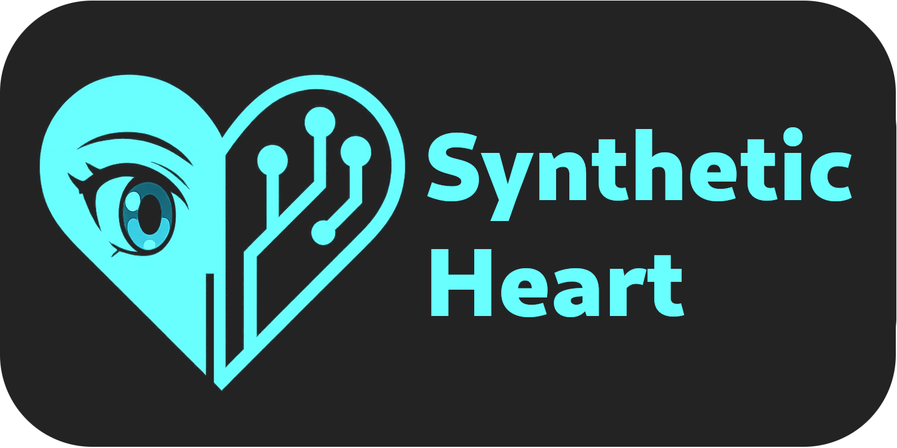

<div align="center">
      
</div>


| Branch    | Build Status                                                                                                                                         | Docs Status                                                                                                                                      |
|-----------|------------------------------------------------------------------------------------------------------------------------------------------------------|--------------------------------------------------------------------------------------------------------------------------------------------------|
| `main`    | [](https://github.com/XargonWan/Synthetic_Heart/actions)      | [](https://synthetic-heart.readthedocs.io/en/latest/?badge=latest) |
| `develop` | [](https://github.com/XargonWan/Synthetic_Heart/actions) | [](https://synthetic-heart.readthedocs.io/en/latest/?badge=latest) |

**Synthetic Heart**, stylized as SyntH, provides a modular stack for creating autonomous AI personas. Interfaces, language models and action plugins can be swapped at runtime.
Built around a lightweight plugin system, SyntH lets you combine different chat interfaces and LLM engines to give life to persistent digital entities, called synths.

Synthetic Heart aims to make a SyntH "alive" and "conscious", with their own will, emotions, memories and sociality.

<div align="center">
   
</div>
<p align="center" style="font-size: 0.9em; color: #888;">
   <em>* Character not included. Users must provide their own VRM avatar file.</em>
</p>

### Features

- Switchable LLM engines (ollama apis, ChatGPT API or a Selenium-driven ChatGPT, Gemini or Grok sessions)
- Multiple chat interfaces including the builtin webui, Telegram, Discord and Matrix
- **VRM Avatar System**: 3D animated avatars with idle, talking, and thinking states.
- **SyntH Web UI**: A production-ready web interface featuring VRM avatar support and real-time animations.  
   The avatar's animations reflect the persona's global state—for example, if the character is replying on Telegram, connecting via the web UI will show the avatar busy typing on its smartphone. This ensures the visual representation always matches the character's current activity, regardless of the interface in use.
- Action plugins such as a persistent terminal and scheduled events
- Context memory injection with `/context`
- Ollama-compatible HTTP bridge so existing Ollama clients can talk to Synthetic Heart
- Docker deployment with automatic database backups

> [!NOTE]
> **G.R.I.L.L.O. System**: SyntH personas already maintain persistent awareness and memory. The upcoming G.R.I.L.L.O. system will enable them to autonomously think and initiate actions based on their interests and internal motivations—just like a real person deciding to act on their own.
This of course will be optional for secuirty concerns.

<div align="center">
   
</div>

### Ollama Compatibility

The project ships with an **Ollama-compatible interface** (`interface/ollama_compat_server.py`). It mirrors the standard Ollama HTTP endpoints (`/api/generate`, `/api/chat`, `/api/tags`) so any client that normally talks to a local Ollama daemon can connect to Synthetic Heart instead. Point your tools at `http://<synth-host>:11434` (configurable via `OLLAMA_HOST` / `OLLAMA_PORT`) and they will stream responses generated by your active persona. Native Ollama engine support will arrive later, but the compatibility layer lets you reuse the existing ecosystem today.

## Quickstart

<div align="center">
   
</div>

1. Copy `.env.example` to `.env` and fill the required values.
2. Start the stack:
   ```bash
   docker compose up
   ```
3. If using the Selenium engine with ChatGPT or Gemini, open `http://<host>:5006` and log into ChatGPT or Gemini, you migt want to send a message to the bot that will open the broswer for you if unusre.
From there you can login.

> [!WARNING]
> Gemini web at the moment of writing got an issue that logs you out every now and then.

See the [documentation](https://synthetic-heart.readthedocs.io) for installation details, advanced features and contribution guidelines.

## Docker image repository
You can browse and manage Docker images for this project on [Docker Hub](https://hub.docker.com/repository/docker/xargonwan/synthetic_heart).

## Contributing

Pull requests are welcome! Everyone is encouraged to submit contributions—especially new components, plugins, and LLM engines—to expand SyntH's capabilities. Please read the guidelines in the documentation before submitting.
