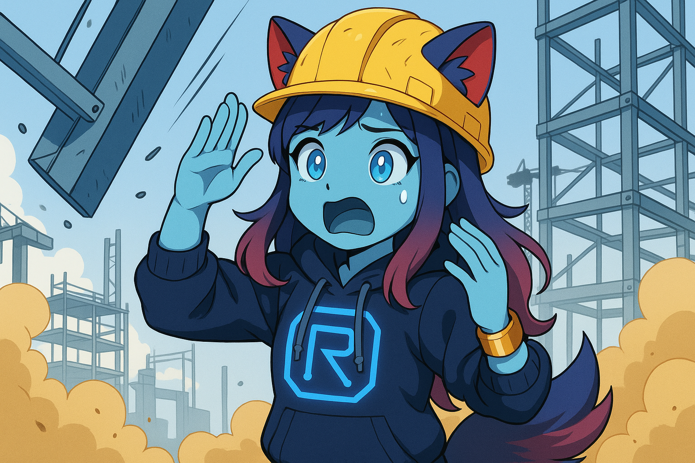

Architecture Overview
=====================

The Rekku Freedom Project is a highly modular AI persona system designed for extensibility and flexibility. The architecture separates concerns into distinct layers, allowing independent development and swapping of components without modifying the core system.

Core Principles
---------------

**Modularity and Extensibility**
    Components (LLM engines, plugins, and interfaces) are not hardcoded in the core. Instead, they are dynamically discovered and loaded at runtime through auto-registration mechanisms. This ensures that new functionality can be added by simply placing compatible modules in the appropriate directories.

**Message-Driven Architecture**
    All interactions flow through a centralized message chain that handles JSON action parsing, validation, and execution. Components communicate through well-defined interfaces rather than direct coupling.

**Registry-Based Component Management**
    Components register themselves with central registries, providing metadata about their capabilities. The core system then orchestrates interactions based on this self-reported information.

System Components
-----------------

``core``
    The foundational layer containing:
    
    - **Message Chain** (``message_chain.py``): Central orchestrator for incoming messages, JSON extraction, and action execution flow.
    - **Action Parser** (``action_parser.py``): Executes validated actions from parsed JSON, routing them to appropriate component handlers.
    - **Core Initializer** (``core_initializer.py``): Auto-discovers and loads all components from ``plugins/``, ``llm_engines/``, and ``interface/`` directories.
    - **Registries**: Centralized management for LLM engines, interfaces, plugins, and validation rules.
    - **Transport Layer**: Handles communication between components and interfaces.

``interface``
    Chat platform integrations (Telegram, Discord, Reddit, etc.). Each interface:
    
    - Inherits from ``AIPluginBase`` or implements compatible interfaces
    - Registers supported actions (e.g., sending messages, media)
    - Handles platform-specific message formatting and rate limiting
    - Provides trainer ID validation for security

``llm_engines``
    Language model backend implementations (OpenAI, Google Gemini, manual input, etc.). Each engine:
    
    - Extends ``AIPluginBase`` for consistent interface
    - Handles prompt construction and response generation
    - Manages model-specific limits and capabilities
    - Supports both text and multimodal interactions

``plugins``
    Action providers that extend Rekku's capabilities (terminal access, weather, file operations, etc.). Each plugin:
    
    - Implements action schemas with required/optional fields
    - Provides prompt instructions for LLM integration
    - Handles validation and execution of specific actions
    - Can be pure action providers or full AI plugins

Message Flow
------------

The following diagram shows the complete message processing pipeline:

.. graphviz::

   digraph message_flow {
       rankdir=TB;
       node [shape=box, style=rounded];
       
       User [label="User Message"];
       Interface [label="Interface\n(Telegram/Discord/etc.)"];
       MessageChain [label="Message Chain"];
       JSONExtract [label="JSON Extraction"];
       ActionParser [label="Action Parser"];
       Component [label="Component\n(Plugin/LLM Engine)"];
       Response [label="Response"];
       
       User -> Interface;
       Interface -> MessageChain;
       MessageChain -> JSONExtract;
       JSONExtract -> ActionParser [label="Valid JSON"];
       JSONExtract -> Corrector [label="Invalid JSON"];
       Corrector -> MessageChain [label="Retry"];
       ActionParser -> Component;
       Component -> Response;
       Response -> Interface;
       Response -> User;
       
       Corrector [label="Corrector Middleware\n(LLM-assisted)"];
   }

**Detailed Flow:**

1. **Message Reception**: Interface receives message from user and forwards to message chain
2. **JSON Detection**: Message chain attempts to extract JSON actions from the text
3. **Validation & Correction**: If JSON is invalid, corrector middleware queries the active LLM engine to fix it
4. **Action Execution**: Validated actions are parsed and routed to appropriate components
5. **Response Generation**: Components execute actions and generate responses
6. **Output Delivery**: Responses are sent back through the originating interface

Component Auto-Discovery
------------------------

Components are automatically discovered through a recursive import system:

- The core initializer scans ``plugins/``, ``llm_engines/``, and ``interface/`` directories
- Each Python file is imported and checked for a ``PLUGIN_CLASS`` attribute
- Compatible classes are instantiated and registered with appropriate registries
- Components self-report their capabilities through standardized methods
- No manual registration or configuration files required

This approach ensures that adding new functionality requires only:
1. Creating a compatible class in the appropriate directory
2. Implementing required interface methods
3. Restarting the application

Security and Validation
-----------------------

- **Trainer ID Validation**: Interfaces validate that commands come from authorized trainers
- **Action Validation**: All actions are validated against component schemas before execution
- **Rate Limiting**: Built-in rate limiting prevents abuse across all components
- **Error Handling**: Comprehensive error handling with user-friendly notifications

The architecture's modular design ensures that security policies can be consistently applied across all components without code duplication.
