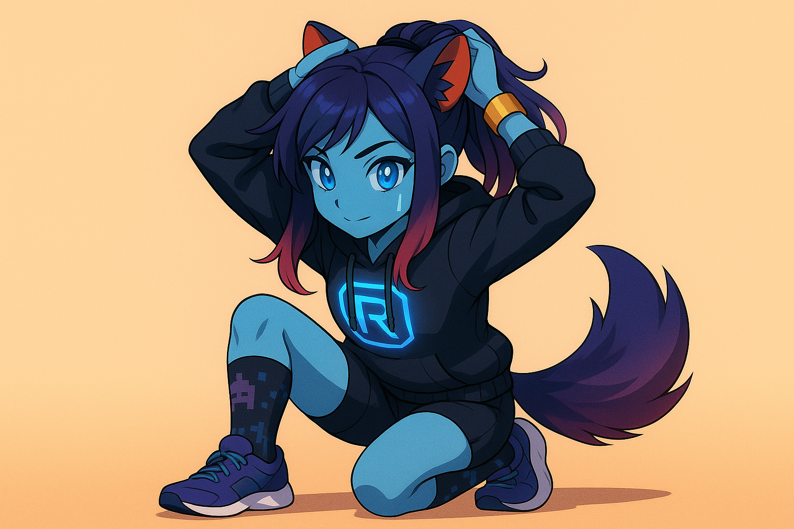

Quickstart
==========

This guide outlines the typical steps to run **Synthetic Heart** using Docker. synth is a modular AI system that automatically discovers and loads components (interfaces, plugins, and LLM engines) at startup.

#. Copy ``.env.example`` to ``.env`` and adjust values as needed. Important
   variables include ``BOTFATHER_TOKEN`` for Telegram, database credentials for
   persistent features, and ``TRAINER_IDS`` for security. The optional
   ``NOTIFY_ERRORS_TO_INTERFACES`` mapping (e.g. ``telegram_bot:123456``)
   defines where error notifications are sent.
#. Build and start the services:

   .. code-block:: bash

      docker compose up

#. The system will automatically discover and load all available components from
   the ``interface/``, ``plugins/``, and ``llm_engines/`` directories.
#. Open the web interface at ``http://<host>:5006`` to perform the initial
   ChatGPT login if you plan to use the ``selenium_chatgpt`` engine.

Database backups are written hourly to ``./backups/``. To tear down the
containers, press :kbd:`Ctrl+C` or run ``docker compose down``.

Component Auto-Discovery
------------------------

synth uses a zero-configuration approach where components are automatically discovered:

- **Interfaces**: Chat platforms like Telegram, Discord, Reddit
- **Plugins**: Action providers like terminal access, weather, file operations
- **LLM Engines**: AI backends like OpenAI, Google Gemini, manual input

Simply place compatible Python files in the appropriate directories and restart - no manual registration required. This modular architecture ensures that functionality can be added or removed without modifying the core system.
